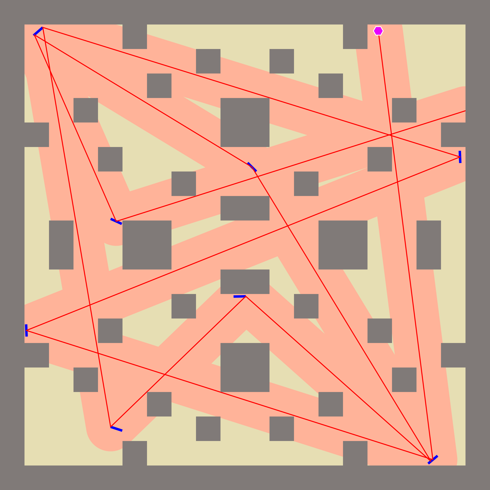

# CMC24 - Projekt za Natjecanje iz Računalnog Modeliranja 2024

Ovaj repozitorij sadrži rješenje za Natjecanje iz Računalnog Modeliranja 2024 (CMC24). Projekt uključuje simulaciju putanje svjetlosti kroz definirani "hram" s ciljem osvjetljavanja što veće površine.
Službene upute nalaze se na: [https://www.fer.unizg.hr/zpm/cmc24/tehnicki_opis](https://www.fer.unizg.hr/zpm/cmc24/tehnicki_opis)

Rješenje:

Tree-Based Evolutionary Algorithm (Branching EA)

Algoritam iterativno generira familiju zrcala tako da u svakom koraku kreira više novih zrcala, zatim evaluira svako zrcalo pomoću kombinacije score-a (pokrivenost hrama) i heurističke metrike pozicije, te odabire samo dva najbolja. Ta dva zrcala zatim služe kao osnova za daljnje grananje – za svako od njih generiraju se po dva nova zrcala, što se ponavlja sve dok se ne postigne unaprijed definirani maksimalni broj zrcala N. Ovaj pristup omogućuje balans između eksploatacije (odabir najboljih) i eksploracije (generiranje novih varijanti). Nakon toga se algoritmom preraspoređivanja zrcala (algoritam maksimizacije) za svake parove


## Struktura Projekta

Projekt je organiziran na sljedeći način:

*   `src/`: Sadrži glavne Julia skripte (`.jl`) koje implementiraju logiku natjecanja.
    *   `cmc24.jl`: Glavna skripta.
    *   `cmc24C.jl`: Skripta za evaluaciju.
    *   Ostale `.jl` datoteke: Pomoćne skripte, editori rješenja ili specifične verzije.
*   `scripts/`: Sadrži pomoćne ili testne skripte.
    *   `points_try.jl`: Skripta za testiranje rada s točkama ili geometrijom.
    *   `try.jl`: Općenita skripta za isprobavanje manjih dijelova koda.
*   `output/`: Sadrži generirane izlazne datoteke.
    *   `images/`: Spremljene slike i vizualizacije (npr. `.png` datoteke).
    *   `heatgrids/`: Podaci vezani za "heatgrid" analize.
    *   `jld2_files/`: Spremljena rješenja i drugi podaci u Julia Data Format (`.jld2`).
*   `README.md`: Ova datoteka s opisom projekta.
*   `.gitignore`: Specificira datoteke koje Git treba ignorirati.
*   `Project.toml` i `Manifest.toml`: (Ako postoje) Definiraju ovisnosti Julia projekta.

## Pokretanje

Za pokretanje glavne simulacije ili evaluacije, vjerojatno ćete koristiti Julia interpreter.

1.  **Instalirajte Juliu:** Ako već niste, preuzmite i instalirajte Juliu s [julialang.org](https://julialang.org/).
2.  **Navigirajte do direktorija projekta:** Otvorite terminal u `c:\Users\roko\OneDrive - fer.hr\Programiranje\cmc24`.
3.  **Aktivirajte projektno okruženje (ako postoji `Project.toml`):**
    ```julia
    using Pkg
    Pkg.activate(".")
    Pkg.instantiate() # Instalira potrebne pakete ako već nisu
    ```
4.  **Pokrenite glavnu skriptu:**
    Pretpostavljajući da je jedna od skripti u `src/` glavna (npr. `src/cmc24.jl` ili `src/cmc24C.jl`):
    ```bash
    julia src/ime_glavne_skripte.jl
    ```
    (Zamijenite `ime_glavne_skripte.jl` s točnim nazivom datoteke.)

## Ovisnosti

Glavne ovisnosti koje se koriste u projektu (na temelju pregledanih skripti):
*   `FileIO`
*   `ImageIO`
*   `Measures`
*   `Plots`
*   `UUIDs`
*   `JLD2`

Ako koristite `Project.toml` i `Manifest.toml`, Julia će automatski upravljati ovim ovisnostima.
